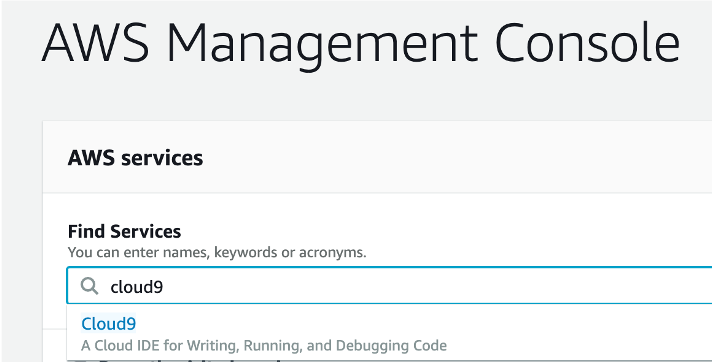
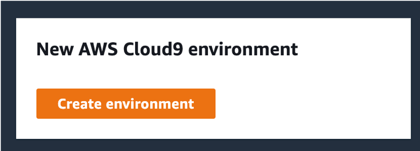
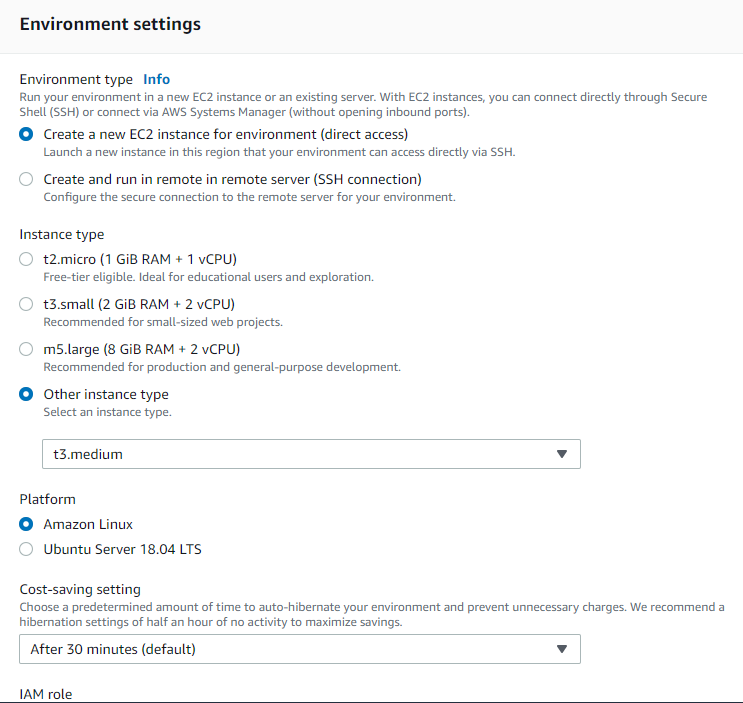

# AWS Hosted Event Setup - Event Engine Setup

Welcome to the Event Engine Setup section! This means that you are attending an AWS Hosted Workshop!! . Event Engine is a tool created at AWS that provisions AWS accounts for workshop events like this! These accounts will automatically terminate 24 hours after the workshop begins participants don't have to worry about leaving anything on. Each workshop participant will receive their own Event Engine AWS account. 

Here is a preview of what we will be setting up:

* Get a temporary AWS account using the AWS Event Engine.
* Provision a Cloud9 IDE instance.

## Step-1 : Get a temporary AWS account using the AWS Event Engine.

For an AWS hosted event, you are provided with an AWS account through the AWS Event Engine service using a 12-digit hash by event staff. This is your unique access code.

1 . Go to [https://dashboard.eventengine.run/](https://dashboard.eventengine.run/).


2. Enter the provided hash code in the text box. 

3. Click on the **Accept Terms & Login** button.

4. Select **AWS Console**.

5. Then select **Open AWS Console**.


6. This workshop supports the region **us-west-2 US West (Oregon)**. Please select **US West (Oregon)** in the top right corner.


You can leave the AWS console open.

## Step-2: Provision a Cloud9 IDE instance.

1. Navigate to the [Cloud9 console](https://console.aws.amazon.com/cloud9/home) or just search for it under the **AWS services** search.

    

2. Click the **Create environment** button.

    

3. For the name, enter `jfrog-workshop` and click **Next Step**.

4. Leave all the other settings as default.

    

5. On the **Review** page, click **Create environment**. The Cloud9 environment will take a few minutes to provision.

6. When the environment comes up, close the **Welcome** page tab.


## Step-3: Install Pre-Requisites

### Install `kubectl`

```shell
mkdir -p $HOME/bin
echo 'export PATH=$PATH:$HOME/bin' >> ~/.bashrc
curl -o kubectl https://amazon-eks.s3.us-west-2.amazonaws.com/1.21.2/2021-07-05/bin/linux/amd64/kubectl
chmod +x ./kubectl
cp ./kubectl $HOME/bin/kubectl

```

### Install `eksctl`

```shell
curl --silent --location "https://github.com/weaveworks/eksctl/releases/latest/download/eksctl_$(uname -s)_amd64.tar.gz" | tar xz -C /tmp
mv /tmp/eksctl ~/bin
eksctl version
. <(eksctl completion bash)

```

### Identity and Access Management

This command first installs jq and then changes the IAM role associated with your Cloud9 instance to use `TeamRoleInstanceProfile` IAM role. `TeamRoleInstanceProfile` is pre-provisioned in the AWS accounts vended via EventEngine and has the necessary access to create EKS cluster.

```shell
sudo yum -y install jq
aws ec2 associate-iam-instance-profile --instance-id $(curl http://169.254.169.254/latest/meta-data/instance-id) --iam-instance-profile Name=TeamRoleInstanceProfile
aws configure set region `curl --silent http://169.254.169.254/latest/dynamic/instance-identity/document | jq -r .region`
echo "export AWS_REGION=$(curl --silent http://169.254.169.254/latest/dynamic/instance-identity/document | jq -r .region)" >> ~/.bashrc
bash

```

## Step-3: Cloud9 IAM setting change

1. Click the gear icon (in top right corner). Select **AWS Settings** and Turn off **AWS managed temporary credentials**.
2. Close the **Preferences** tab.

    